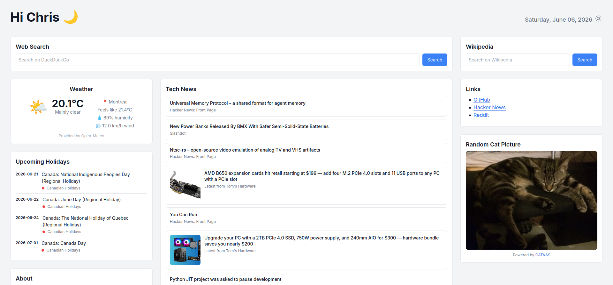

# `Salut` - Self-Hosted Start Page

**Salut** means **Hi** in French. It is a self-hosted, fully configurable start page featuring customizable content cards.



## Features

* Single web page with no login (meant to be locally hosted)
* YAML-based configuration
* Internationalization (English and French currently supported)
* Layout consisting of cards based on plugins:

    * [Calendar](docs/plugins/calendar.md)
    * [GitHub](docs/plugins/github.md)
    * [HTML](docs/plugins/html.md)
    * [Image](docs/plugins/image.md)
    * [RSS](docs/plugins/rss.md)
    * [Search](docs/plugins/search.md) (currently supports DuckDuckGo and Wikipedia)
    * [Weather](docs/plugins/weather.md) (uses [Open-Meteo](https://open-meteo.com/))
    * [XKCD](docs/plugins/xkcd.md)

## Getting Started

### Prerequisites

* Git
* Python 3.11+
* [pipenv](https://pipenv.pypa.io/)

### Initial Setup

```bash
git clone https://github.com/plbrault/salut.git
cd salut
pipenv sync
```

### Configuration

Copy `starter.yml` to `config.yml` and edit it to customize your page. Refer to the [documentation](docs/config.md) for available configuration options.

### Running

```bash
pipenv run app
```

The server starts at `http://localhost:8000`.

To use a custom port:

```bash
PORT=9001 pipenv run app
```

**Note:** The application uses an ephemeral SQLite database. It is recreated on each server start. All cached data (RSS feeds, weather, calendar events, etc.) is re-fetched automatically.

### Permanent Installation (Linux)

On Linux, run `./install.sh` to install as a systemd service. The script will ask what port to use, or you can specify it with `--port`.

## Development

### Commands

Start the server with hot-reloading:

```bash
pipenv run develop
```

Run unit tests:

```bash
pipenv run pytest
```

Run linter:

```bash
pipenv run pylint
```

## Contributing

Pull requests for new plugins, bugfixes, or backward-compatible improvements are welcome.

If you use AI, please ensure your agent follows all instructions in `AGENTS.md`. You are encouraged to use [OpenSpec](https://github.com/Fission-AI/OpenSpec) skills to specify your changes in the repository's `openspec/specs` folder.

## License

Copyright © 2026 Pier-Luc Brault <pier-luc@brault.me>

This program is free software: you can redistribute it and/or modify it under the terms of the GNU Affero General Public License as published by the Free Software Foundation, either version 3 of the License, or (at your option) any later version.

This program is distributed in the hope that it will be useful, but WITHOUT ANY WARRANTY; without even the implied warranty of MERCHANTABILITY or FITNESS FOR A PARTICULAR PURPOSE. See the GNU Affero General Public License for more details.

You should have received a copy of the GNU Affero General Public License along with this program. If not, see <https://www.gnu.org/licenses/>.
